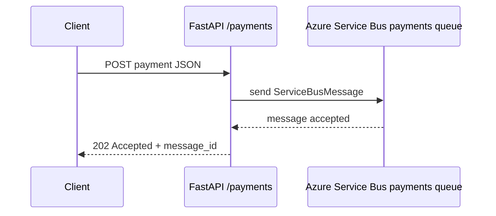
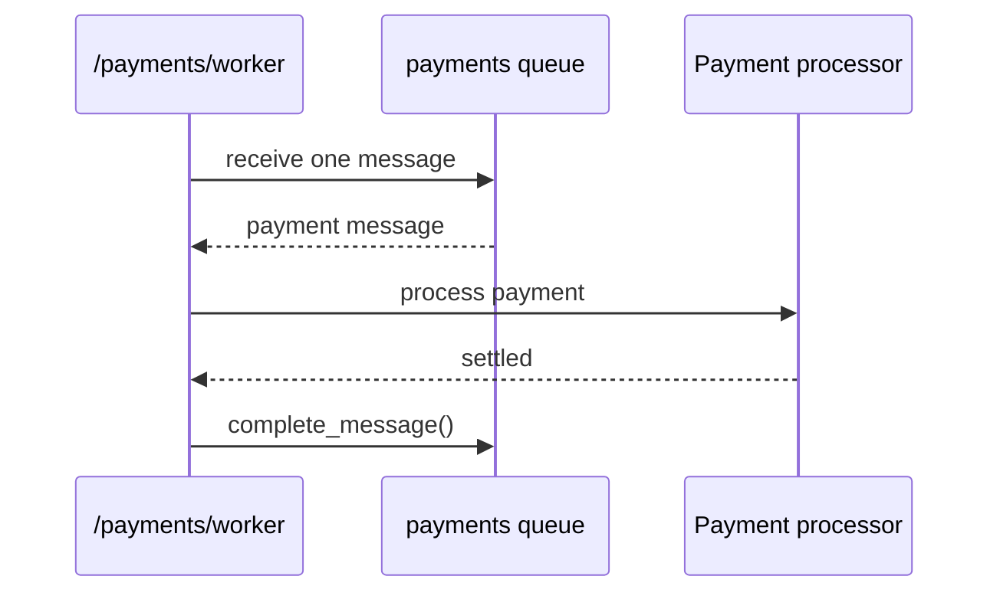
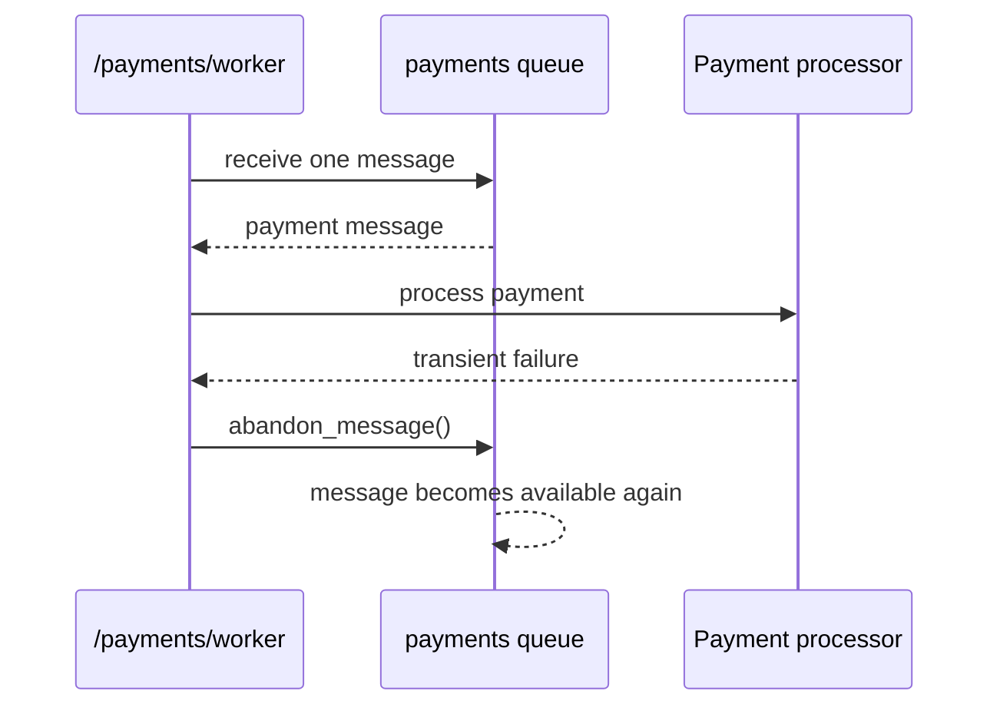
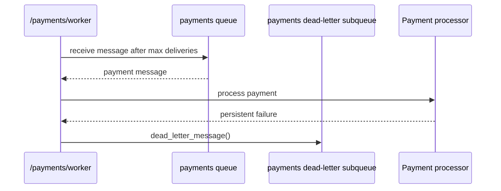
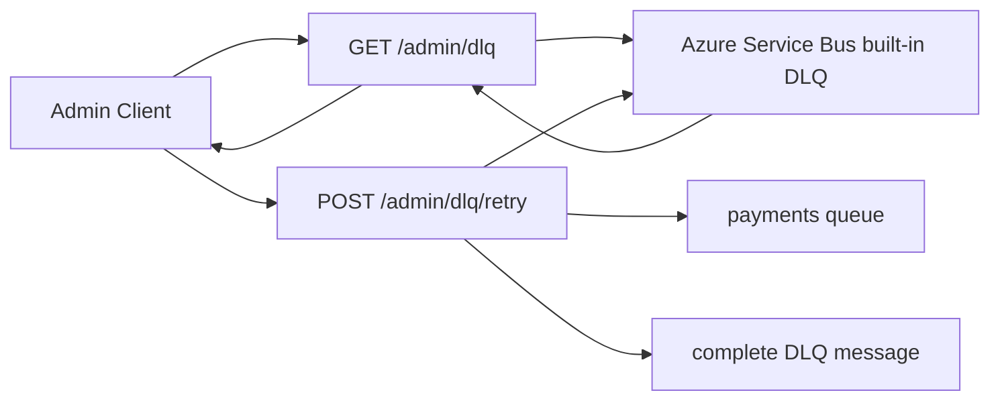

# Day 9 - Azure Service Bus Extension Task

Extension B from Demo 2: replace the in-memory queue broker with Azure Service Bus.

## Goal

- Publish payment messages to an Azure Service Bus queue named `payments` by default.
- Process queued payments through a worker endpoint.
- Dead-letter persistently failing messages into the queue's built-in DLQ.
- Inspect and replay messages from the Azure Service Bus DLQ.
- Compare Azure Service Bus DLQ handling with RabbitMQ dead-letter exchanges.

## Setup

Create an Azure Service Bus namespace and queue, then set:

```powershell
$env:SB_CONN_STR = "<your-service-bus-connection-string>"
$env:SB_QUEUE_NAME = "payments"
```

Install dependencies from the repo root if needed:

```powershell
..\.venv\Scripts\python.exe -m pip install -r requirements.txt
```

## Run

From this folder:

```powershell
..\..\..\.venv\Scripts\python.exe -m uvicorn app:app --reload --port 8001
```

Open:

```text
http://127.0.0.1:8001/docs
```

## Try It

```powershell
curl http://127.0.0.1:8001/health/ready

curl -X POST http://127.0.0.1:8001/payments `
  -H "Content-Type: application/json" `
  -d "{\"amount\":1500,\"currency\":\"GBP\",\"account_id\":\"ACC-001\"}"

curl http://127.0.0.1:8001/payments/worker
curl http://127.0.0.1:8001/admin/dlq
curl -X POST http://127.0.0.1:8001/admin/dlq/retry
```

## Queue Scenarios

### 1. Publish Payment



### 2. Worker Success



### 3. Temporary Failure And Retry



### 4. Persistent Failure To DLQ



### 5. Inspect And Replay DLQ



### End-To-End Flow

```mermaid
flowchart TD
    Client[Client] -->|POST /payments| API[FastAPI API]
    API -->|send message| Queue[payments queue]
    Worker[/payments/worker] -->|receive| Queue
    Worker --> Processor[Payment processor]
    Processor -->|success| Complete[complete message]
    Processor -->|temporary failure| Abandon[abandon message]
    Abandon --> Queue
    Processor -->|persistent failure| DLQ[payments built-in DLQ]
    Admin[Admin endpoints] -->|GET /admin/dlq| DLQ
    Admin -->|POST /admin/dlq/retry| Queue
```

## RabbitMQ vs Azure Service Bus DLQ

RabbitMQ dead-lettering is configured through exchanges and queue arguments such as `x-dead-letter-exchange`. Messages are routed to a separate DLQ queue by broker rules you define.

Azure Service Bus has a built-in dead-letter subqueue for every queue. The app calls `dead_letter_message()` when processing fails, inspects the DLQ through `ServiceBusSubQueue.DEAD_LETTER`, and replays by sending a fresh copy back to the main queue before completing the DLQ message.

## Test

```powershell
..\..\..\.venv\Scripts\python.exe -m pytest tests
```
